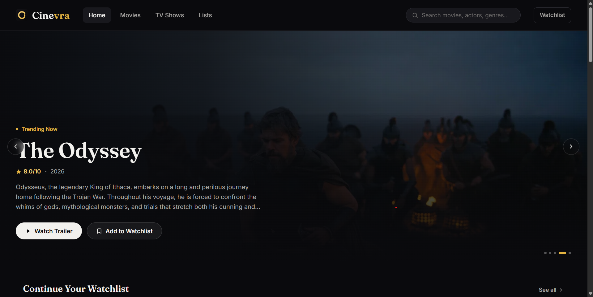

# Cinevra

Cinevra adalah website untuk menemukan film dan serial TV dengan tampilan gelap bernuansa sinematik. Proyek ini dibuat dengan HTML, CSS, dan JavaScript murni. Data judul, poster, pemeran, dan trailer diambil dari TMDB. Watchlist disimpan di browser sehingga tetap tersedia saat halaman dibuka kembali.



## Yang bisa dilakukan

- Melihat film dan serial TV yang sedang populer
- Membuka halaman detail untuk melihat sinopsis, pemeran, genre, judul serupa, dan trailer
- Menambahkan atau menghapus judul dari watchlist
- Menyaring judul berdasarkan genre, tahun, dan urutan
- Membuka tampilan yang nyaman di layar desktop maupun ponsel

## Teknologi

- HTML5
- CSS3 dengan Flexbox, Grid, dan custom properties
- JavaScript ES6
- TMDB API untuk data film dan serial TV
- localStorage untuk menyimpan watchlist

## Menjalankan proyek

1. Buat API key dari akun TMDB
2. Salin `js/api.example.js` menjadi `js/api.js`
3. Ganti nilai `TMDB_API_KEY` di dalam `js/api.js` dengan API key milikmu
4. Jalankan proyek melalui local server

Kamu bisa memakai ekstensi Live Server di VS Code atau menjalankan perintah berikut bila Python sudah tersedia

```powershell
python -m http.server 5500
```

Setelah itu buka `index.html` melalui alamat local server yang dibuat.

## Struktur proyek

```text
Cinevra
├── assets
│   └── images
├── css
│   ├── style.css
│   ├── home.css
│   ├── movies.css
│   ├── detail.css
│   └── watchlist.css
├── js
│   ├── api.example.js
│   ├── main.js
│   ├── home.js
│   ├── movies.js
│   ├── tv-shows.js
│   ├── detail.js
│   └── watchlist.js
├── index.html
├── movies.html
├── tv-shows.html
├── detail.html
└── watchlist.html
```

## Catatan penting

File `js/api.js` sengaja tidak masuk ke Git karena berisi API key pribadi. Gunakan `js/api.example.js` sebagai template saat menyiapkan proyek di perangkat baru.

Data film dan serial TV disediakan oleh The Movie Database. Cinevra adalah proyek pribadi dan tidak berafiliasi dengan TMDB.

## Pembuat

Dibuat oleh Rafif Shula Syandana untuk proyek pembelajaran Pemrograman Web.
