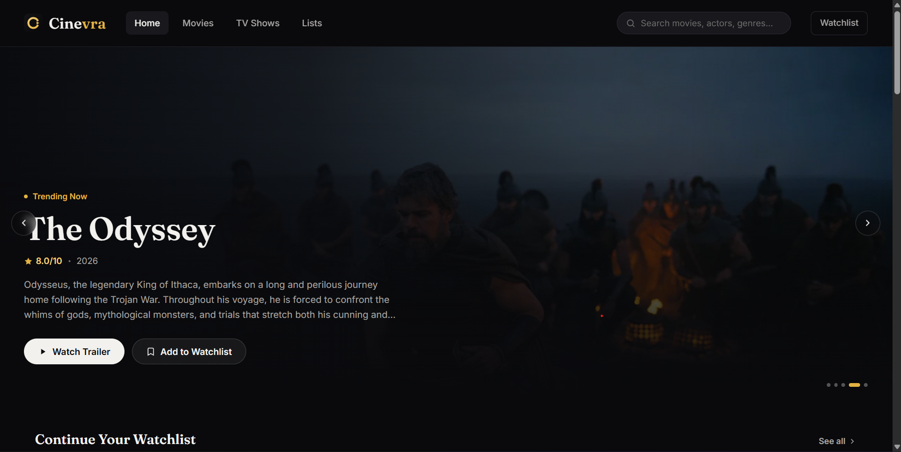

# Cinevra

Cinevra adalah website untuk menemukan film dan serial TV dengan tampilan gelap bernuansa sinematik. Proyek ini dibuat dengan HTML, CSS, dan JavaScript murni. Data judul, poster, pemeran, dan trailer diambil dari TMDB. Watchlist disimpan di browser sehingga tetap tersedia saat halaman dibuka kembali.



## Yang bisa dilakukan

- Melihat film dan serial TV yang sedang populer
- Membuka halaman detail untuk melihat sinopsis, pemeran, genre, judul serupa, dan trailer
- Menambahkan atau menghapus judul dari watchlist
- Menyaring judul berdasarkan genre, tahun, dan urutan
- Membuka tampilan yang nyaman di layar desktop maupun ponsel

## Teknologi

- HTML5
- CSS3 dengan Flexbox, Grid, dan custom properties
- JavaScript ES6
- TMDB API untuk data film dan serial TV
- localStorage untuk menyimpan watchlist

## Menjalankan proyek

1. Buat API key dari akun TMDB
2. Salin `js/api.example.js` menjadi `js/api.js`
3. Ganti nilai `TMDB_API_KEY` di dalam `js/api.js` dengan API key milikmu
4. Jalankan proyek melalui local server

Kamu bisa memakai ekstensi Live Server di VS Code atau menjalankan perintah berikut bila Python sudah tersedia

```powershell
python -m http.server 5500
```

Setelah itu buka `index.html` melalui alamat local server yang dibuat.

## Struktur proyek

```text
Cinevra
├── assets
│   └── images
├── css
│   ├── style.css
│   ├── home.css
│   ├── movies.css
│   ├── search.css
│   ├── detail.css
│   └── watchlist.css
├── js
│   ├── api.example.js
│   ├── main.js
│   ├── home.js
│   ├── movies.js
│   ├── tv-shows.js
│   ├── search.js
│   ├── detail.js
│   └── watchlist.js
├── index.html
├── movies.html
├── tv-shows.html
├── search.html
├── detail.html
└── watchlist.html
```

## Catatan penting

File `js/api.js` sengaja tidak masuk ke Git karena berisi API key pribadi. Gunakan `js/api.example.js` sebagai template saat menyiapkan proyek di perangkat baru.

Data film dan serial TV disediakan oleh The Movie Database. Cinevra adalah proyek pribadi dan tidak berafiliasi dengan TMDB.

## Pembuat

Dibuat oleh Rafif Shula Syandana untuk proyek pembelajaran Pemrograman Web.
## Rating pribadi, episode, dan platform streaming

Halaman detail bisa menyimpan rating pribadi dari 1 sampai 10, tanggal menonton, dan catatan singkat. Detail TV juga punya centang per episode, tombol untuk menandai satu season, dan progres keseluruhan season reguler. Episode spesial tidak dihitung. Data disimpan di localStorage browser tanpa akun dan akan hilang jika data browser dihapus.

Katalog Movies dan TV Shows punya filter negara dan platform streaming. Negara awal pada katalog biasa adalah Indonesia. Pilih All countries untuk melihat katalog tanpa batasan streaming. Pilihan tersimpan di URL dan bisa digabung dengan genre, tahun, urutan, serta Load More. Hasil mencakup streaming berlangganan, gratis, dan dengan iklan. Memilih filter streaming dari kategori akan membuka katalog umum. Kosongkan pencarian judul untuk memakai filter streaming. Ketersediaan berasal dari TMDB dan JustWatch dan bisa berubah.

Jalankan pemeriksaan dengan `node scripts/test-personal.js`, `node scripts/test-personal-ui.js`, `node scripts/test-streaming.js`, dan `node scripts/test-streaming-ui.js`.

Parameter streaming mengikuti [dokumentasi Discover TMDB](https://developer.themoviedb.org/reference/discover-movie). Episode dimuat lewat [endpoint detail season](https://developer.themoviedb.org/reference/tv-season-details).

## My Space

Buka My Space dari navbar untuk memakai tiga fitur personal berikut.

- Backup & Restore mengunduh JSON berisi watchlist, custom Lists, tanda ditonton, rating pribadi, tanggal menonton, catatan dan progres episode. File impor maksimal 2 MB, divalidasi dan ditampilkan ringkasannya sebelum pengguna mengonfirmasi penggantian seluruh library. Download backup lama sebelum restore. API settings dan riwayat browsing tidak disertakan.
- My Stats menghitung film unik yang ditandai ditonton di Lists atau punya tanggal menonton. Rata-rata memakai rating pribadi film dan TV. Genre favorit dihitung dari film ditonton dengan detail TMDB, sementara aktivitas 12 bulan memakai tanggal menonton film dan TV. Tanda episode tanpa tanggal tidak masuk aktivitas bulanan.
- For You mengambil rekomendasi dari maksimal enam judul yang diberi rating pribadi minimal 8/10 atau disimpan di Lists, dengan prioritas rating tinggi. Judul tersimpan yang diberi rating lebih rendah tidak dipakai sebagai favorit. Hasil digabung tanpa duplikat, dengan alasan rekomendasi, serta mengecualikan judul tersimpan dan yang sudah diberi rating, tanggal menonton atau progres episode.

Backup dan angka statistik lokal tidak memerlukan internet. Genre favorit dan For You memerlukan konfigurasi TMDB serta koneksi internet. Request yang gagal diberi pesan dan tombol untuk mencoba lagi. Catatan pribadi ikut masuk file backup, jadi simpan file itu di tempat privat.

Jalankan `node scripts/test-library.js` untuk validasi backup, rollback storage, statistik dan sumber rekomendasi. Pengujian Chrome terisolasi tersedia lewat `node scripts/test-library-browser.js` bila Playwright tersedia di lingkungan dan Chrome terpasang. Tidak ada dependency aplikasi baru. Pengujian browser memakai data TMDB tiruan untuk memeriksa interaksi, kondisi gagal dan tata letak 320, 768, 1024 dan 1440 piksel.

For You memakai endpoint resmi [movie recommendations](https://developer.themoviedb.org/reference/movie-recommendations) dan [TV recommendations](https://developer.themoviedb.org/reference/tv-series-recommendations) melalui helper di `js/api.js`.
